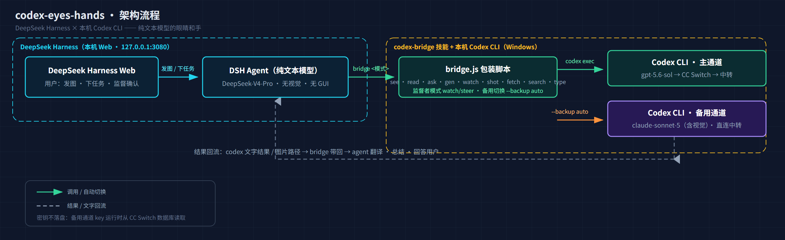
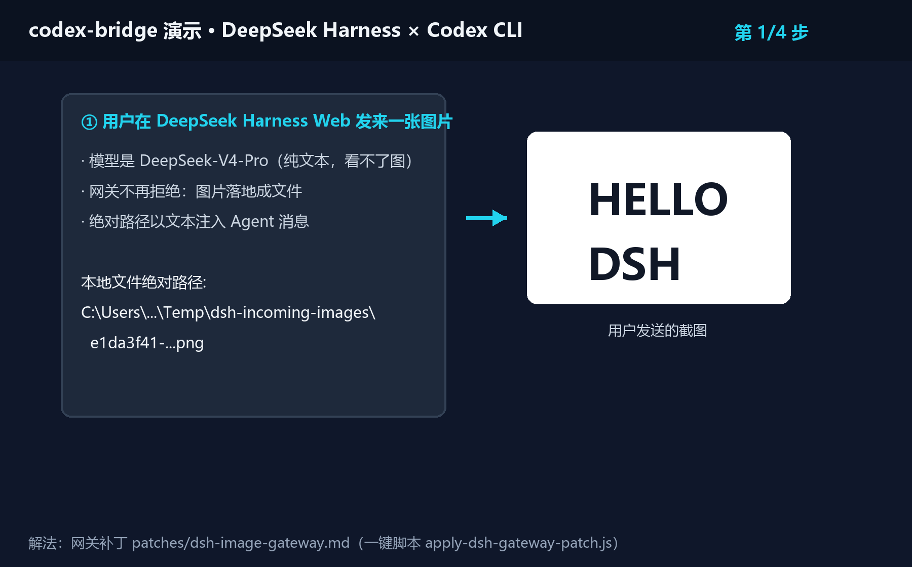
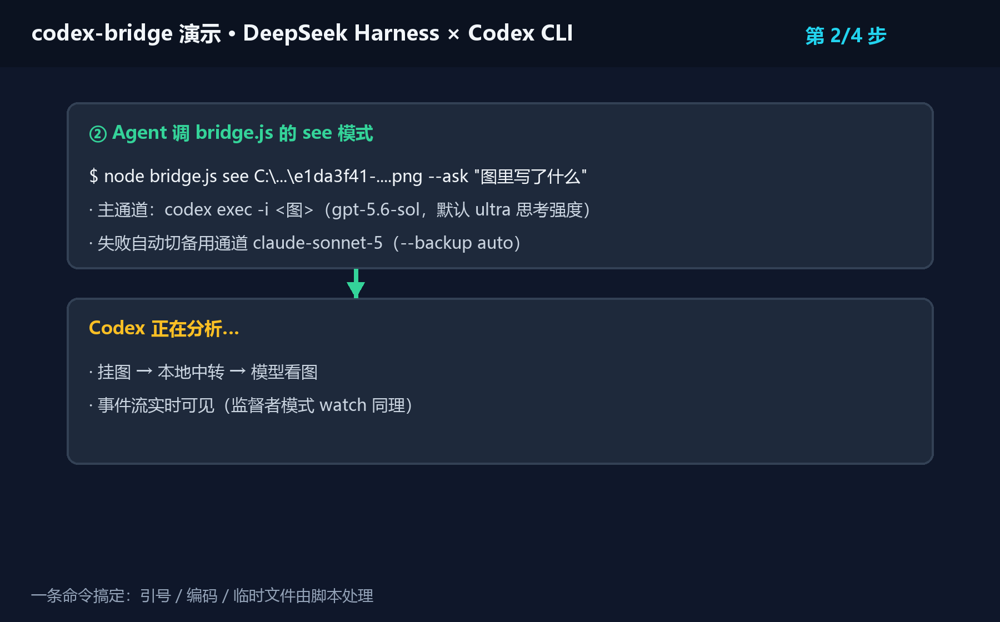
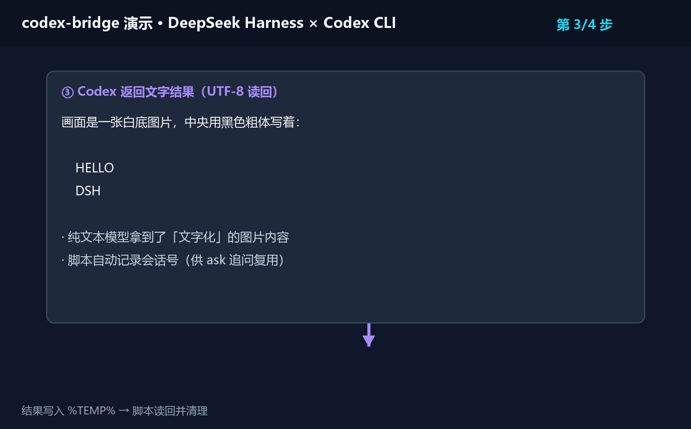
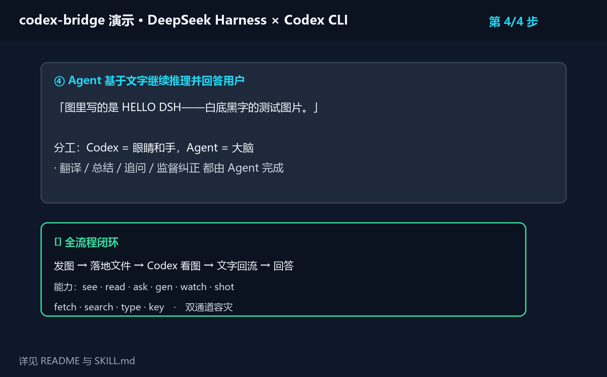

[中文](README.md) | English

# codex-eyes-hands · Codex Capability-Extension Skill

> **Built primarily for [DeepSeek Harness](https://github.com/deepseek-ai/deepseek-harness)**:
> gives text-only models inside Harness (e.g. DeepSeek-V4-Pro — no vision, no GUI control)
> the ability to call the local **Codex CLI** as their **eyes and hands**:
> vision / file reading / image generation / supervised execution / dual-channel failover.

The skill itself has zero dependencies and also works standalone with any agent that can invoke
the local Codex CLI (Codex desktop app, other agent frameworks).

> 👉 **Images rejected in DSH ("current model does not support images")?** See the
> "Fixing: current model does not support images" section below — a one-click patch script is provided.


## Capabilities

| Mode | What it does | Tested |
|---|---|---|
| `see` | Image analysis / OCR / multi-image compare / image URLs (**direct vision, seconds**) | ✅ |
| `locate` / `ocr` | UI element coordinates / OCR with bounding boxes (JSON) | ✅ |
| `probe` | Relay model list + red-rectangle vision self-test | ✅ |
| `click` / `scroll` | Coordinate click / wheel scroll (vision→action loop) | ⚠️ experimental |
| `read` | Archives / folders / special formats (multiple targets) | ✅ |
| `ask` | Follow-up on the last session without re-sending images | ✅ |
| `gen` | Generate images and save them to disk | ✅ |
| `watch` | Supervisor mode: delegate a task, watch execution, stop & correct | ✅ |
| `shot` | Screenshot the screen and analyze it | ✅ |
| `fetch` / `search` | Fetch a webpage / live web search | ✅ |
| `hands` | Browser / GUI automation (browser_use / computer_use) | ⚠️ permission-gated |
| `type` / `key` | Send keystrokes to a specific window | ⚠️ experimental |
| Backup channel | Auto-switch to Claude when the primary channel fails | ✅ |

## Architecture



## Fixing: current model does not support images (DSH users: read this first)

A Harness agent running a text-only model (e.g. DeepSeek-V4-Pro) gets image messages rejected by
the gateway ("current model does not support images") — the image never reaches the agent.

**Fix**: patch `@deepseek-ai/dsh-host-apiproxy` — images are **materialized to files** and their
**absolute paths are injected into the message as text**, so the agent can analyze them with the
`see` mode. The conversation also shows **image thumbnails** (companion adapter patch in the patch doc).

- Patch reference: [patches/dsh-image-gateway.en.md](patches/dsh-image-gateway.en.md)
- **One-click patch script**: [patches/apply-dsh-gateway-patch.js](patches/apply-dsh-gateway-patch.js)
  (auto backup + verification + rollback; see the usage comment at the top; restart `dsh web` afterwards)

## Requirements

- Windows + Node.js ≥ 22.5 (24 recommended; the backup-channel key reader uses `node:sqlite` —
  below 22.5 everything else still works, only that reader is unavailable)
- [Codex CLI](https://github.com/openai/codex) (npm global install; tested on v0.145.0)
- (Optional) CC Switch: the backup channel's API key is read at runtime from its database (`~/.cc-switch/cc-switch.db`)

## Recommended relay (invite link)

Both the primary channel and the Claude backup channel of this skill are **verified against one relay**
(GPT / Claude endpoints, responses wire format, vision — all working).
If you need a relay, you can register via the maintainer's invite link:

👉 https://ai-zjl.cc/register?aff=HVUNFKHSEATR

(This is the project maintainer's invite link. After registering you'll get an API base URL and a key
to fill into your Codex config. Setup tutorial: [docs/relay-setup.en.md](docs/relay-setup.en.md).)

## Installation

1. Put this repo into your skills directory, final layout:
   `C:\Users\<YourName>\.codex\skills\codex-bridge\` (containing `SKILL.md` and `scripts\bridge.js`)
2. Open `SKILL.md` and replace the example paths (`C:\Users\Administrator\...`) with your own.
3. (Optional) Configure the Claude backup channel:
   - Copy `examples/claude.config.toml.example` → `C:\Users\<You>\.codex\claude.config.toml`,
     set `base_url` to your relay and `model` to a Claude model your relay supports.
   - Also register the same `[model_providers.claude]` block in `~/.codex/config.toml`
     (`codex exec resume` does not load profile files).
   - No key is written to disk: the script reads a Claude key (not shared with any codex channel)
     from the CC Switch database at runtime.

**Updating**: run `git pull` inside the skills directory (or re-download this repo).

## Quick start

```powershell
node "C:\Users\<You>\.codex\skills\codex-bridge\scripts\bridge.js" see "C:\img.png" --ask "what does the image say"
node "C:\Users\<You>\.codex\skills\codex-bridge\scripts\bridge.js" read "C:\archive.zip" "C:\some-folder"
node "C:\Users\<You>\.codex\skills\codex-bridge\scripts\bridge.js" watch "zip all txt files in some folder, keep the originals"
node "C:\Users\<You>\.codex\skills\codex-bridge\scripts\bridge.js" shot "what is on screen"
```

See `SKILL.md` for the full parameter reference and per-mode details.

## Demo

Full flow — send image → materialize file → Codex analyzes → text flows back → agent answers (four steps):

| ① User sends image | ② Codex analyzes |
|---|---|
|  |  |
| ③ Text flows back | ④ Agent answers |
|  |  |

## Security notes

- This repo contains no API keys; the backup key is read from your local CC Switch database at runtime.
- `type` / `key` send real keystrokes: user confirmation first, `--window` is mandatory, sending is
  cancelled if the window cannot be focused, and it must not be used while a fullscreen game holds focus
  (see `SKILL.md` mode 8).
- `watch` ships with guardrails: stay in scope, never delete/overwrite, report before risky actions.

## FAQ

- **Codex keeps reporting `Our servers are currently overloaded` / stream disconnects?**
  The relay's upstream is overloaded or rate-limiting. Wait and retry, switch channels in CC Switch,
  or use `--backup only` to force the Claude backup. If it stays unstable, consider another relay
  (see "Recommended relay" above).
- **Images are rejected with "current model does not support images"?**
  The DSH gateway blocks images for text-only models. Apply the patch in
  [patches/dsh-image-gateway.en.md](patches/dsh-image-gateway.en.md).
- **Backup channel errors with `Model provider 'claude' not found`?**
  The claude provider is not registered in `~/.codex/config.toml` (`resume` doesn't load profiles).
  Add the block shown at the end of `examples/claude.config.toml.example`.
- **Can this leak my API key?**
  No. The key is read from your local CC Switch database, injected only into the current process,
  never written to disk; the repo contains no keys.
- **How do I verify the installation?**
  `node "...\scripts\bridge.js" see "some.png" --ask "what does the image say"` — a description
  in response means it works.
- **macOS / Linux supported?**
  The script currently targets Windows (PowerShell / cmd / WScript; `type`/`key` rely on Windows
  windowing). The core logic is just wrapping Codex CLI calls, so it can be ported.

## License

MIT
